#  Cooking Instructions - Dự án Vue 3
Giới thiệu
Một website hướng dẫn nấu ăn hiện đại được xây dựng với Vue 3, giúp người dùng dễ dàng khám phá các công thức được phân loại, tìm kiếm nhanh chóng và trải nghiệm giao diện mượt mà, thân thiện với mọi thiết bị.

 **Trang web trực tuyến**: https://cooking-instructions.vercel.app/

 **Đăng nhập Admin:** + tên đăng nhập: hung
                      + mật mật khẩu: 123

---

##  TÍNH NĂNG

Đã hoàn thành:
**Danh sách công thức được phân loại (Bữa sáng, trưa, tối…)**
**Trang chi tiết công thức gồm:**
++ Nguyên liệu

++ Hướng dẫn từng bước

++ Các công thức liên quan ở thanh bên

**Chức năng giỏ hàng (Shopping Cart)**

 **Trang Admin**

 **Chức năng lọc**

 **Đặt hàng**

### ĐANG PHÁT TRIỂN 

Lưu công thức yêu thích

Bình luận và đánh giá công thức

Chế độ sáng/tối

Giao diện responsive cho thiết bị di động

---

##  Công nghệ sử dụng
**Frontend**
- Vue 3
- Vite
- Quản lý trạng thái( Pinia)
- Điều hướng( Vue Router)
- Gửi yêu cầu API( Axios )
- Tailwind CSS 
- Heroicons – Icon hiện đại
**Hosting Frontend** :  Vercel

**Backend**
- PHP (Vanilla)
**Cơ sở dữ liệu**
- phpMyAdmin 


**Hosting Backend** : InfinityFree Hosting
---

##  Trạng thái dự án

- **Giai đoạn hiện tại**: Đang phát triển  
- **Bắt đầu**: Tháng 7 năm 2025  
- **Dự kiến hoàn thành**: Tháng 9 năm 2025

---

##  Ảnh minh họa
 **Trang Admin**
  |  |  | 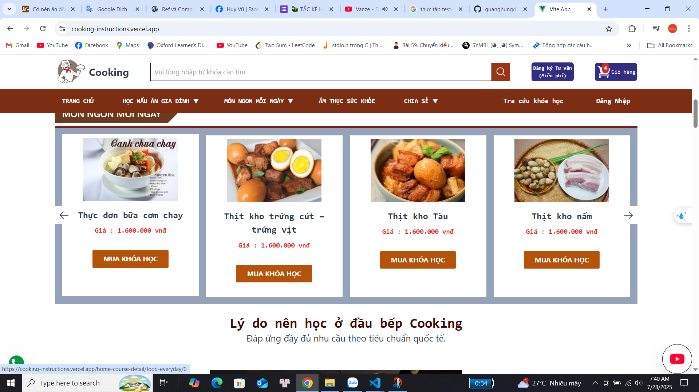

 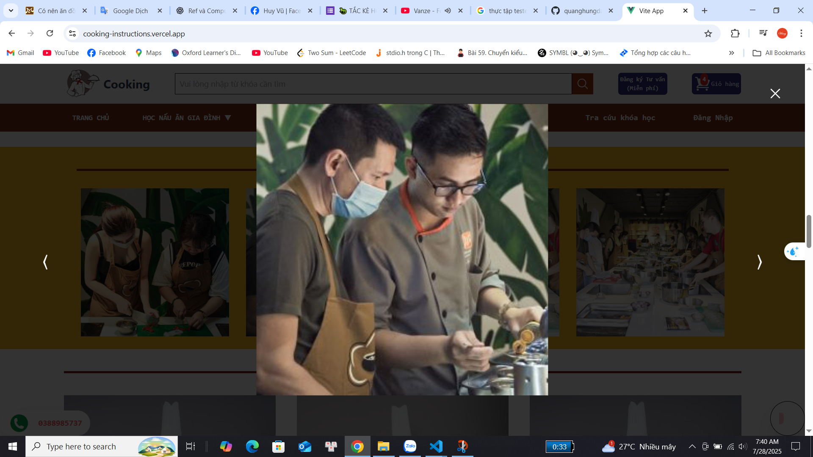 |  | 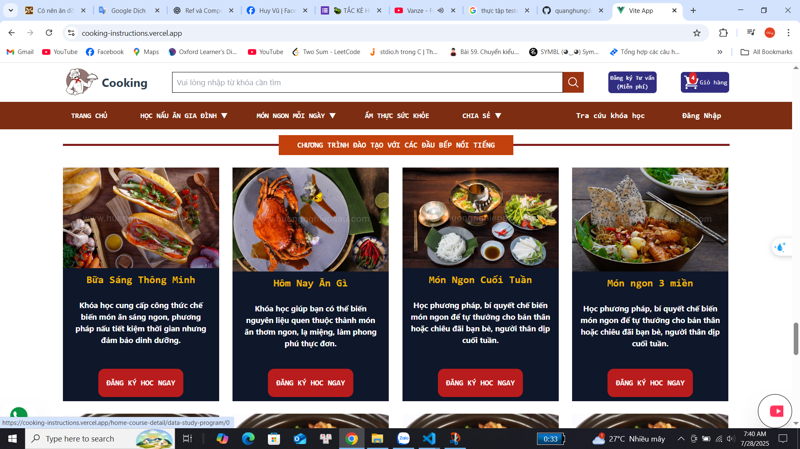 | 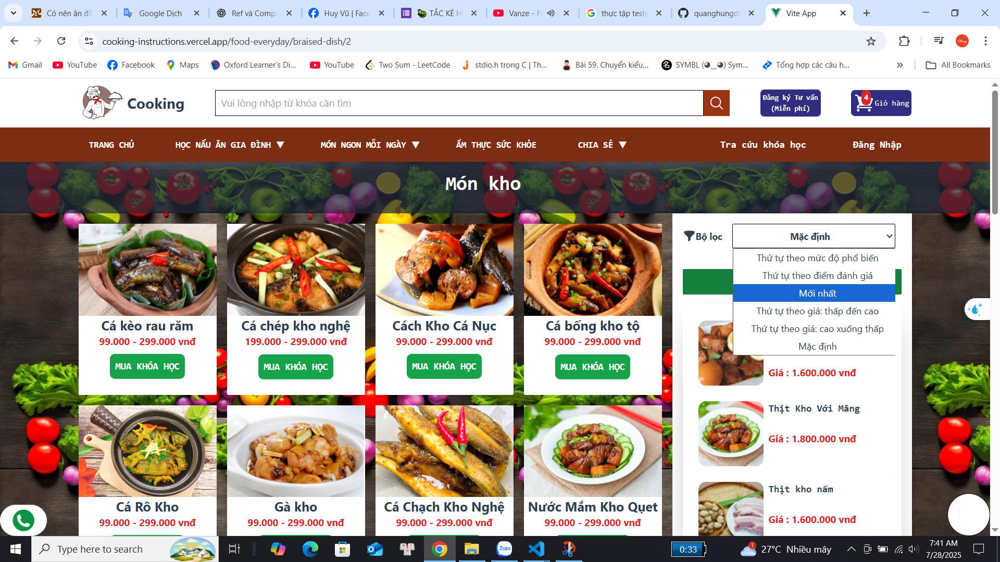
---
 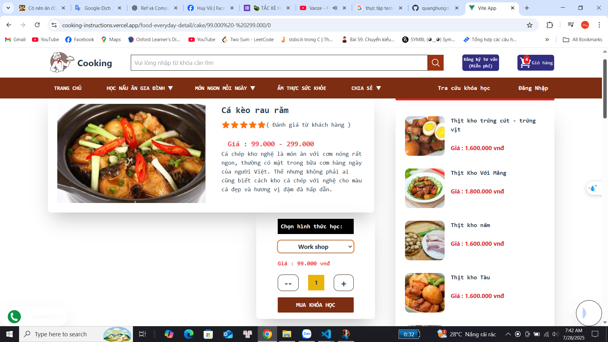 | 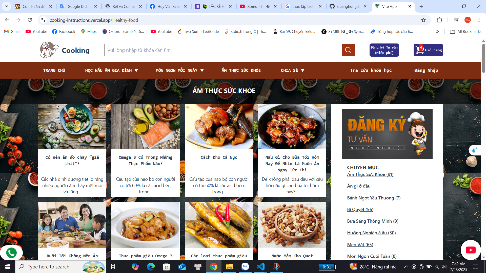 | 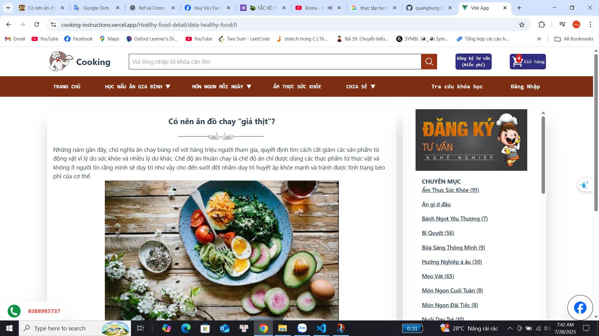 | 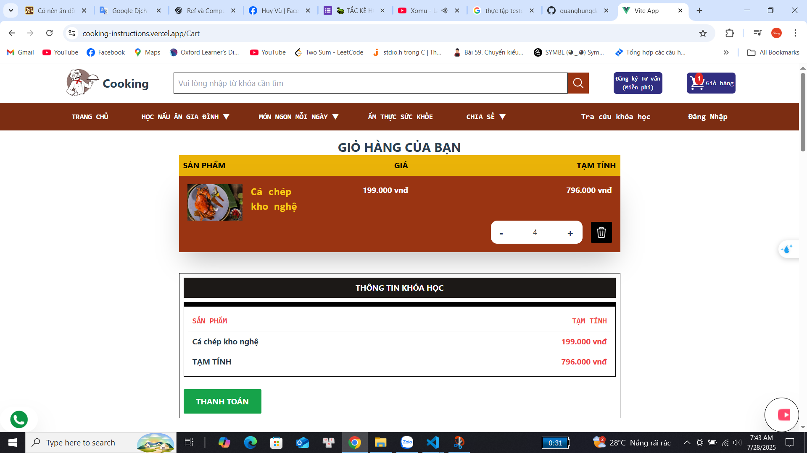
  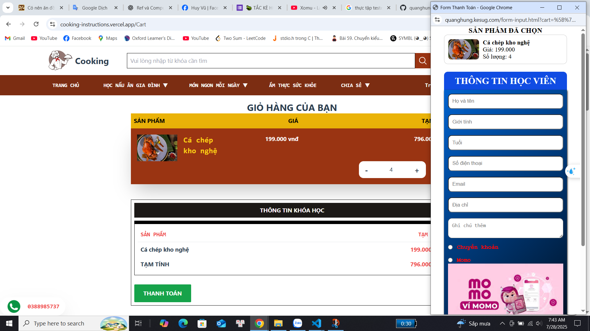 | 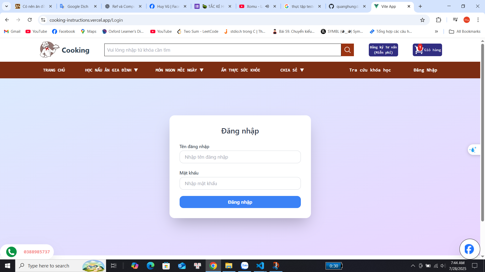 | 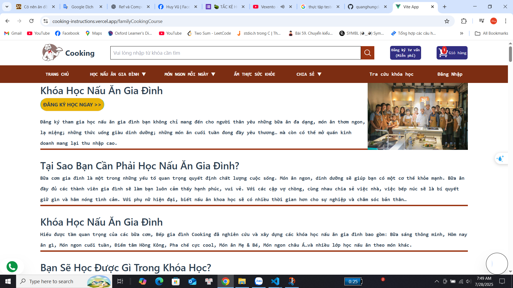 | 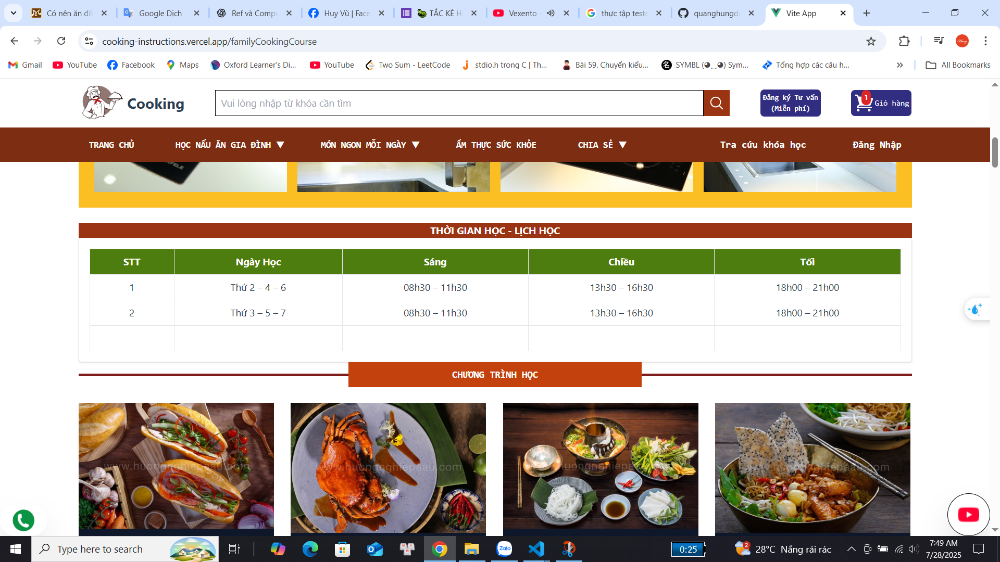
  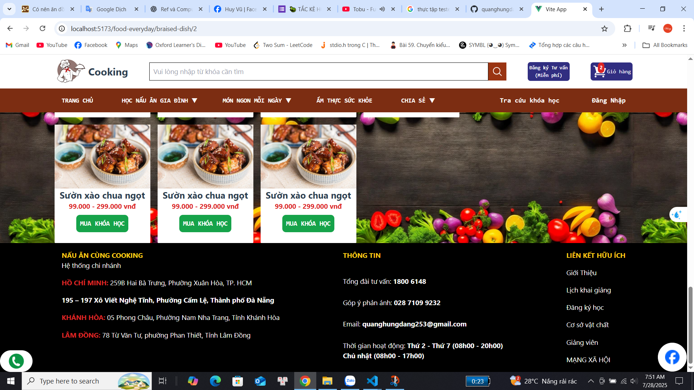 
---
---

## Cách chạy dự án trên máy

```bash
# Clone dự án
git clone https://github.com/quanghungdang253/Cooking-Instructions.git

# Di chuyển vào thư mục dự án
cd Cooking-Instructions

# Cài đặt các package
npm install

# Chạy dự án
npm run dev

Lời cảm ơn
Cảm ơn bạn đã quan tâm và trải nghiệm dự án Cooking Instructions. Hy vọng website sẽ giúp bạn có thêm thật nhiều ý tưởng và cảm hứng cho những bữa ăn ngon miệng!