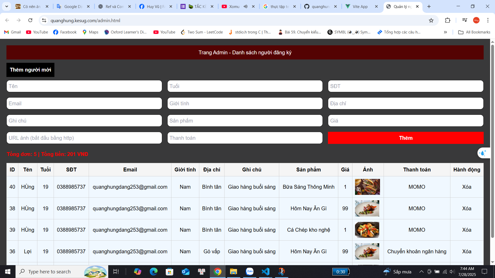
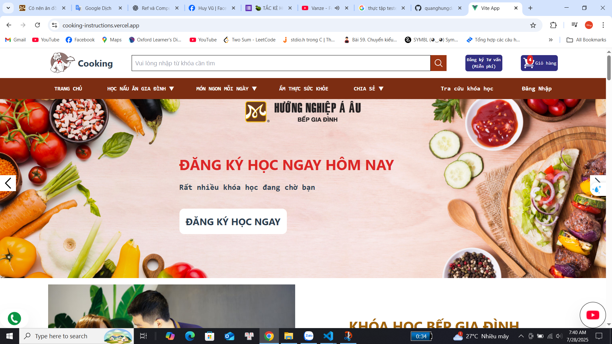
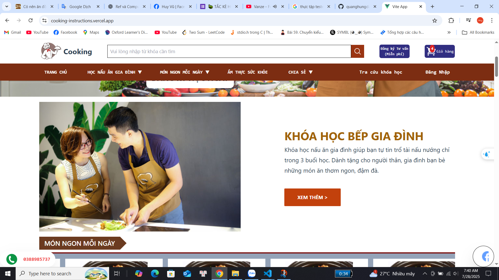
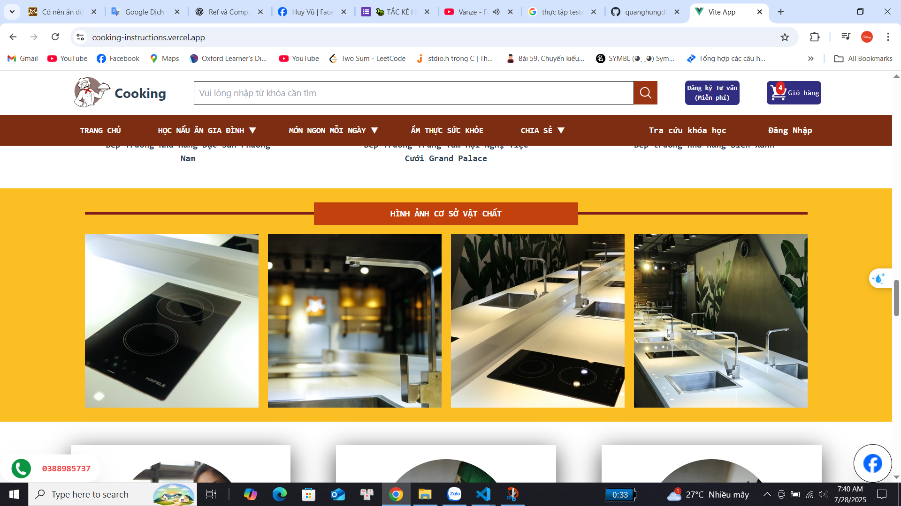

#  Cooking Instructions - Dự án Vue 3
Giới thiệu
Một website hướng dẫn nấu ăn hiện đại được xây dựng với Vue 3, giúp người dùng dễ dàng khám phá các công thức được phân loại, tìm kiếm nhanh chóng và trải nghiệm giao diện mượt mà, thân thiện với mọi thiết bị.

 **Trang web trực tuyến**: https://cooking-instructions.vercel.app/


---

##  Tính năng

### Đã hoàn thành

-  Danh sách công thức được phân loại (bữa sáng, trưa, tối…)
-  Trang chi tiết công thức với:
  - Nguyên liệu
  - Hướng dẫn từng bước
  - Các công thức liên quan ở thanh bên
-  Chức năng giỏ hàng (Shopping cart)

### Đang phát triển

-  Đăng nhập và đăng ký tài khoản
-  Lưu công thức yêu thích
-  Bình luận và đánh giá công thức
-  Trang quản trị (Admin) để quản lý công thức
-  Chế độ sáng tối
-  Responsive Mobie

---

##  Công nghệ sử dụng

- Vue 3
- Vite
- Quản lý trạng thái( Pinia)
- Điều hướng( Vue Router)
- Gửi yêu cầu API( Axios )
- Tailwind CSS 
- Heroicons – Icon hiện đại

---

##  Trạng thái dự án

- **Giai đoạn hiện tại**: Đang phát triển  
- **Bắt đầu**: Tháng 7 năm 2025  
- **Dự kiến hoàn thành**: Tháng 9 năm 2025

---

##  Ảnh minh họa

> _Hãy thêm các ảnh demo trong thư mục `screenshots/` và cập nhật đường dẫn nếu cần._


  |  |  | 

  |  |  | 
---

## Cách chạy dự án trên máy

```bash
# Clone dự án
git clone https://github.com/quanghungdang253/Cooking-Instructions.git

# Di chuyển vào thư mục dự án
cd Cooking-Instructions

# Cài đặt các package
npm install

# Chạy dự án
npm run dev
